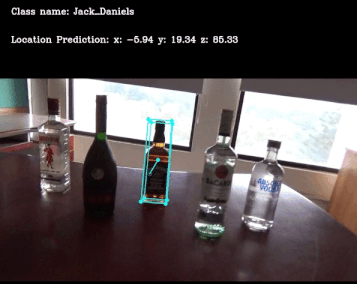

# DOPE.pytorch 
This is an unofficial implementation of **[DOPE (Deep Object Pose Estimation for Semantic Robotic Grasping of Household Objects)](https://arxiv.org/abs/1809.10790)** trained on self-created synthetic bottle dataset.  



## Requirement
```
$ conda create -n DOPE python=3.6
$ pip install -r requirement.txt
$ conda activate DOPE
```

## Usage
### Train and Eval
[WIP]

### Demo
* Logs
[[Download](https://drive.google.com/drive/folders/1DtJ_yOZ946_tn-zGtEIdp2IkRRbtFzza?usp=sharing)]
 ```
  DOPE.pytorch
    - logs
      - Jack_Daniels-checkpoint.pth
      - Jose_Cuervo-checkpoint.pth
  ```
   
   
* Data
[[Download](https://drive.google.com/file/d/1o-Z_ILr8-fcT90bV-IMp5mXHQqEN0u3Y/view?usp=sharing)]
```
DOPE.pytorch
  - data
    - Real_bottle_sequence
      - 000001.jpg
      - 000002.jpg
      ...
      - _object_settings.json
      - _camera_settings.json

```
* Run
```
python demo.py
  --path_to_data_dir ./data/Real_bottle_sequence
  --class_name Jack_Daniels
  --checkpoint ./logs/Jack_Daniels-checkpoint.pth
  --plot
```

## Reference
* DOPE (Deep Object Pose Estimation for Semantic Robotic Grasping of Household Objects) [[paper link](https://arxiv.org/abs/1809.10790)]
* Some code is borrowed from below repos.
  * Official implementation from nvidia (inference code with ROS) [[Deep_Object_Pose](https://github.com/NVlabs/Deep_Object_Pose)]
  * Realtime_Multi-Person_Pose_Estimation [[pytorch_Realtime_Multi-Person_Pose_Estimation](https://github.com/tensorboy/pytorch_Realtime_Multi-Person_Pose_Estimation)]
